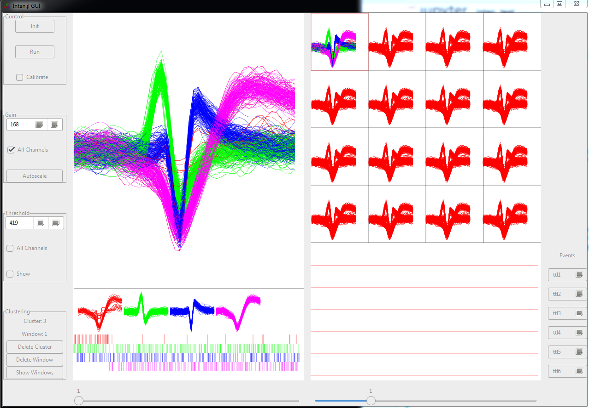

####
GUI
####

*********
Overview
*********

A simple GUI is under development that will control 1) data acquisition, 2) visualization, 3) automatic and manual spike sorting, and 4) experimental control.

**************
Creating GUI
**************

*****************
Data Acquisition
*****************

===================
Connecting to Intan
===================

Simply click the "Init" button

**************
Visualization
**************

**************
Spike Sorting
**************

=======
Manual
=======

=========
Automatic
=========

Intan.jl is integrated with the SpikeSorting.jl package for automatic spike sorting of multi-channel recordings.

********************
Experimental Control
********************
