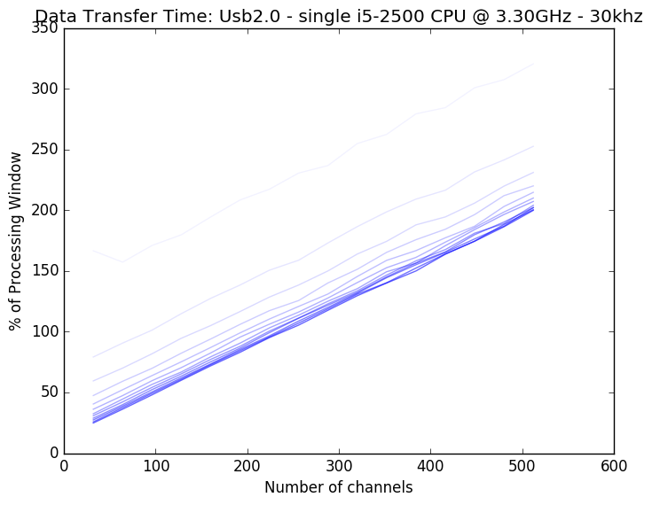
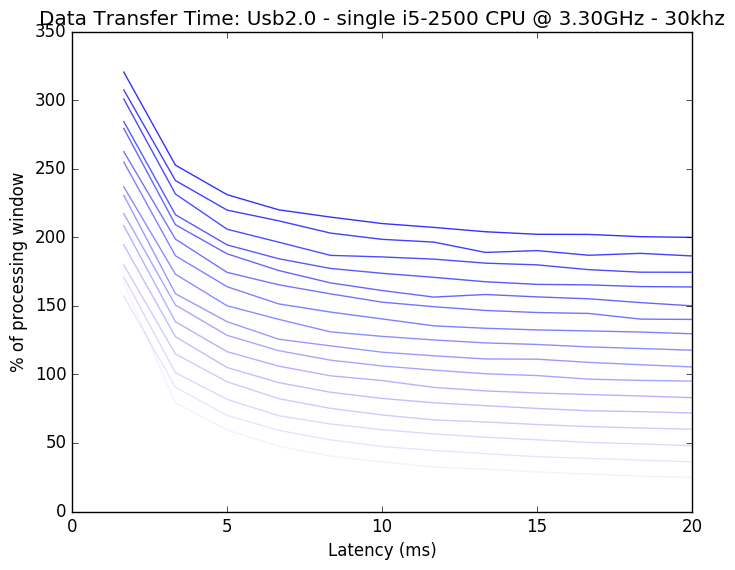
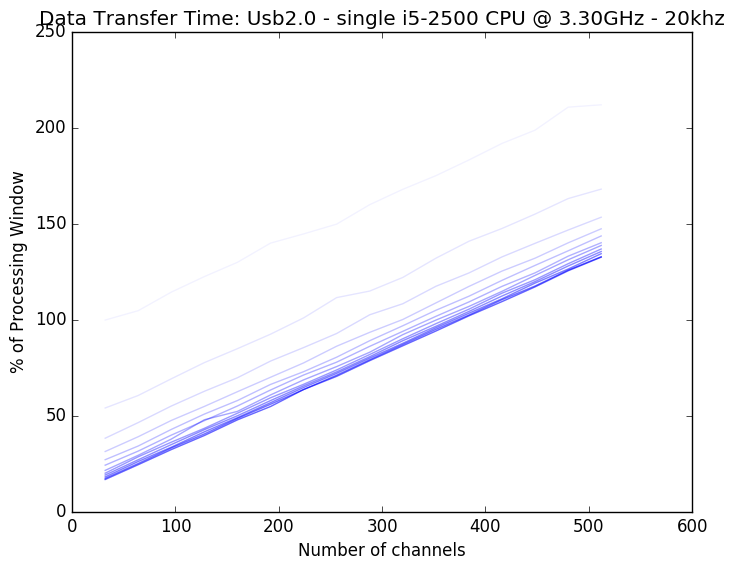
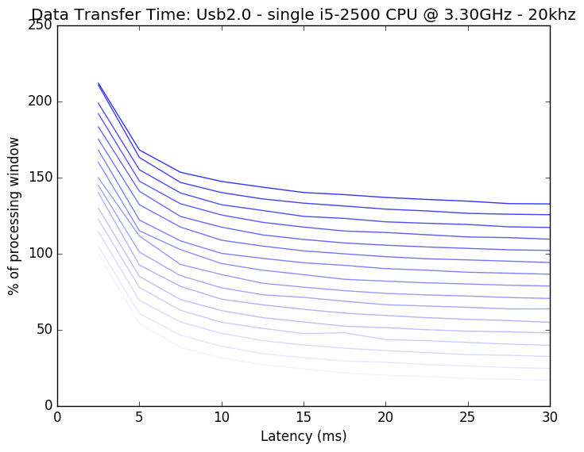

############
Performance
############

*********
Overview
*********

Intan.jl can be used in a variety of experimental setups, such as recording from many electrodes simultaneously, or performing closed loop experiments. A "high performance" setup may be different depending on the experimental paradigm. We will demonstrate some metrics of performance below, and highlight how Intan.jl can be used to achieve different experimental goals.

**********
Variables
**********

The technical demands necessitated by this data acquisition method is based on two primary factors: how much data we are acquiring per unit time, and how frequenty we need to communicate with the acquisition device (as there is some overhead in each communication). We have control over some

============
Sample Rate
============

Our sample rate defines how many samples we are going to collect from each electrode per second. A higher sampling rate will necessarily mean that more data must be transferred from the acquisition board to the computer. However, the sampling rate also sets our temporal resolution for characterizing waveforms: too low of a sample rate will not allow us to sufficiently characterize and separate extracellular potentials from different neurons.

========
Latency
========

Latency defines how frequently we communicate with the acquisition board to transfer new signals. There is some overhead in this process (the acquisition board must put the data into a form that can be transferred). This process also sets number of times a closed loop experiment can be implemented per second. For instance, a latency of 10 ms allows for a 100 iterations of closed loop control per second. This also means that whatever additional processing of the neural signals (visualization, decoding, saving etc) should all take place in the time window of 10ms minus whatever time is needed to transfer the data from the acquisition board to the experimental computer.

=============
Channel Count
=============

More channels means more data will need to be transferred per unit time.

==============================
Experimental Control Computer
==============================

In general, don't cheap out for performance critical equipment.

=======================
Data Transfer Protocol
=======================

The default method for how data gets from the data acquisition device to the experimental computer uses usb2.0. The transfer rate of usb2.0 is slow when compared to the newer usb3.0 or something like ethernet. The FPGA board used by the default Intan evaluation board (which uses usb2.0) also comes in a usb3.0 and PCI version. These protocols would allow for faster data transfer, but will require some low level tinkering to implement.

************
Performance
************

A general experimental workflow will be this: the acquisition board gathers data from the headstages; the acquisition board transfers data to the experimental control computer; the experimental control computer implements spike sorting, task logic, data visualization and data saving.

Of the above steps, transferring data from the acquisition board to the experimental computer is the most resource intensive. Additionally, the methods of improving the speed of that step are fundamentally different and require much more "low level" tinkering. For that reason, we will report the "Data Transfer" time separately from the "Data Processing" time.

Rather than report units of processing "time", we are going to normalize values to the sampling latency. For instance, if we are bringing data over from the data acquisition board every 30 ms, and a processing step takes 15 ms, we will report this value as using "50% of processing window".  Therefore, values above 100% are strictly impossible to implement, as the entire process (data transfer + data processing) must be less than 100%.

==============
Data Transfer
==============

First, let us characterize the time to transfer data from an unmodified evaluation board that can be purchased from Intan Technologies. This uses a usb2.0 communication protocol. We can first compare how much time it takes to process data from an increasing number of channels:

Here we have plotted an increasing latency (sampling less frequency from the acquisition board, with values ranging from 1.7 ms to 20 ms with increasing opacity). First, we note that the data transfer time is roughly linear with increasing channel count. Second, we see that there is a nonlinear relationship with latency, with very small latencies such as 1.7ms being impossible even for small channel counts. This relationship is better visualized here, with transfer time as a function of latency, with increasing channel count lines increasing in opacity:

This better displays that very low latencies (<5ms) are asymptotically inefficient, while latency becomes a smaller factor after this value.

We can also see that most points on these plots fall above the 100% impossibility line. For high channel counts, we are simply transferring too much data for a usb2.0 protocl to realistically handle. Partly for this reason, the off the shelf Intan evaluation board is only made to handle 256 channels simultaneously. 

We can add the possibility of more channels in a few ways. First we could decrease the amount of data that needs to be transferred. This can be easily done by decreasing the sampling rate for each channel. If we cut our sampling rate from 30khz as above to 20khz (below which would make most spike sorting methods fairly difficult) we can see improvement:

